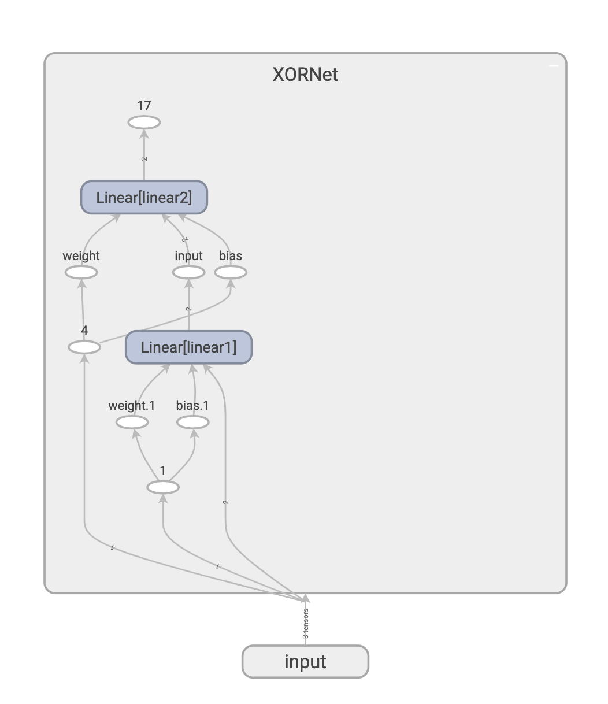

# xor-net

使用两层神经网络解决异或问题，主要目的是在简单网络中，可以很方便的推导反向传播中的梯度。

## 运行

```bash
pip install torch tensorboard

python xor.py
```

## 可视化

```bash
tensorboard --logdir=runs

# open http://localhost:6006
```

